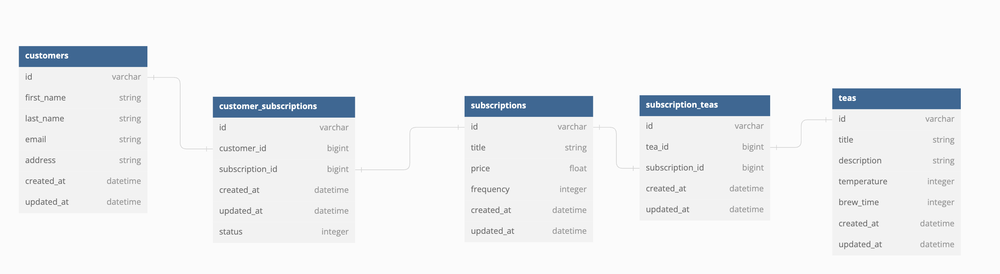

# Tea Subscription Service API


## Built With

- Ruby 3.1.1
- Rails 7.0.4

## Getting Started
  To demo this API:
  1. Clone this repo ```git@github.com:jadekstewart3/tea_subscription.git```
  1. Navigate to the root folder: ```cd tea_subscription```
  1. Run: ```bundle install```
  1. Run: ``` rails db:{create,migrate,seed}```
  1. Run: ```rails s```
  1. Visit http://localhost:3000/

## Schema



## Testing

To test the suit run ```bundle exec rspec``` . All tests should be passing.

## Endpoints

<details>
<summary> GET: Customer Subscriptions</summary>

<br>

Request:
```JS
GET /api/v1/customers/#{customer_id}/subscriptions
```
Params:
 | Name | Requirement | Type | Description |
  | ----- | ----------- | -----| -------------- | 
  | `customer_id` | Required | integer | Customer ID

  <br>

  Response: 
  | Result | Status |
  | ------- | ------| 
  | `Success` | 201 |
  | `Failure`| 401 |

  ```JSON
  {
    "data": {
        "id": "1",
        "type": "customers",
        "attributes": {
            "first_name": "Oneida",
            "last_name": "Bogan",
            "email": "wm_feeney@walker.test",
            "address": "Suite 132 9844 Legros Extensions, Bashirianfort, NY 11404-3241",
            "customer_subscriptions": {
                "data": [
                    {
                        "id": "1",
                        "type": "customer_subscriptions",
                        "attributes": {
                            "id": 1,
                            "customer_id": 1,
                            "title": "Tsathoggua",
                            "status": "active",
                            "price": 98.68,
                            "frequency": 4
                        }
                    },
                    {
                        "id": "2",
                        "type": "customer_subscriptions",
                        "attributes": {
                            "id": 2,
                            "customer_id": 1,
                            "title": "Azathoth",
                            "status": "inactive",
                            "price": 63.79,
                            "frequency": 4
                        }
                    },
                    {
                        "id": "3",
                        "type": "customer_subscriptions",
                        "attributes": {
                            "id": 3,
                            "customer_id": 1,
                            "title": "Yog-Sothoth",
                            "status": "active",
                            "price": 52.29,
                            "frequency": 1
                        }
                    }
                ]
            }
        }
    }
}
```
</details>

<details>
<summary> POST: Customer Subscription</summary>
<br>
Request:

```JS
POST /api/v1/customers/#{customer_id}/subscriptions
```
<br>

Params:
 | Name | Requirement | Type | Description |
  | ----- | ----------- | -----| -------------- | 
  | `customer_id` | Required | integer | Customer ID

<br>

Response:

  | Result | Status |
  | ------- | ------| 
  | `Success` | 201 |
  | `Failure`| 400 |

```JSON
{
    "data": {
        "id": "9",
        "type": "customer_subscriptions",
        "attributes": {
            "id": 9,
            "customer_id": 2,
            "title": "Azathoth",
            "status": "active",
            "price": 63.79,
            "frequency": 4
        }
    }
}
```
</details>

<details>
<summary> PATCH: Cancel a Customer Subscription</summary>

<br>
Request:

```JS
POST /api/v1/customers/#{customer_id}/subscriptions/#{subscription_id}
```
<br>

Params:
 | Name | Requirement | Type | Description |
  | ----- | ----------- | -----| -------------- | 
  | `customer_id` | Required | integer | Customer ID
  |`subscription_id`| Required | integer| Subscription ID
<br>

Response:

  | Result | Status |
  | ------- | ------| 
  | `Success` | 201 |
  | `Failure`| 404 |

  ```JSON
  {
    "data": {
        "id": "9",
        "type": "customer_subscriptions",
        "attributes": {
            "id": 9,
            "customer_id": 2,
            "title": "Azathoth",
            "status": "inactive",
            "price": 63.79,
            "frequency": 4
        }
    }
}
```
</details>

# Developer

##Jade Stewart


  <a href="https://github.com/jadekstewart3">GitHub</a><br>
  <a href="https://www.linkedin.com/in/jadestewart-software-engineer/">LinkedIn</a>
